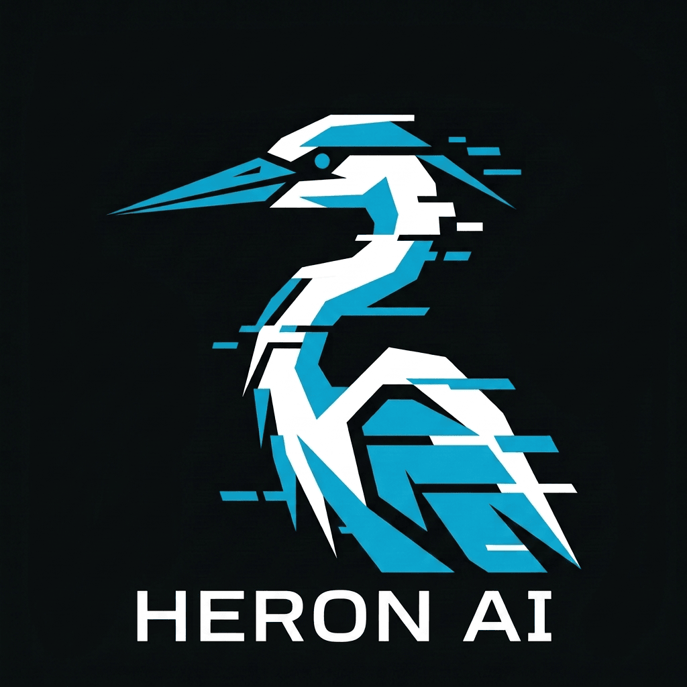

# Heron AI

<p align="center">
  
</p>

[](https://www.npmjs.com/package/heron-ai)
[](LICENSE)

> [English](README.md) | **中文**

**Heron AI** 是一个基于 Go 标准库实现的多 Agent 通用引擎，无框架依赖。

## 快速开始

```bash
npm install -g heron-ai
heron
```

## 功能

- 多 Agent 编排（Flow + Team + Signal）
- 回合制 Agent 运行时（Prompt + Tool + Guardrail + HITL + Handoff）
- 可扩展（Lua / WASM / 外部脚本）
- TUI 终端界面（bubbletea）
- 文件存储（JSONL + Markdown）
- MCP 协议支持

## 文档

- [为什么选择 Heron AI](docs/why-heron.md) - 解决的问题、设计理念、对比
- [快速开始](docs/getting-started.md) - 安装和配置
- [CLI 命令](docs/cli-reference.md) - 所有可用命令
- [配置说明](docs/configuration.md) - 设置、模型、提供商
- [Flow 指南](docs/flow-guide.md) - 如何设计和运行 Flow
- [Agent 指南](docs/agent-guide.md) - Agent 配置和行为
- [扩展指南](docs/extension-guide.md) - Lua / WASM / 脚本扩展
- [示例](examples/) - 示例 Flow 配置

## 开发

```bash
git clone https://github.com/heron-ai/heron-engine.git
cd heron-engine
go build ./cmd/server/
```

## 许可证

MIT - 详见 [LICENSE](LICENSE)
