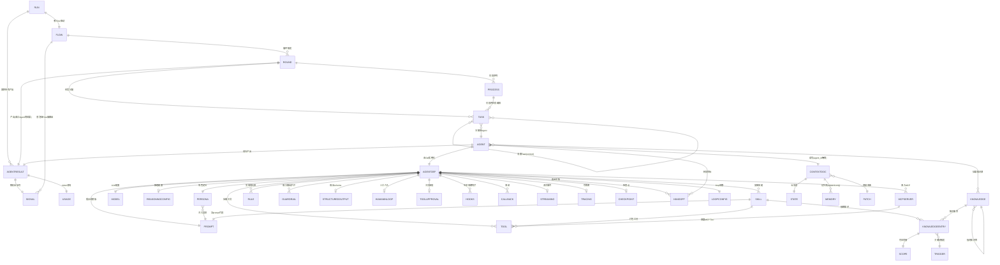

# 02 实体关系图（总-分-总）

> 目录：`docs/generic-engine/`
> 本篇定位：**只做关系图**。从顶层三层骨架逐层展开，最后收口到完整实体关联图。
> 前置阅读：`01-ddd-strategic.md`（通用语言、实体清单）

---

## 一、总图：三层骨架

引擎 = **Run（完整编排容器）→ Round（一次 Agent 协作）→ Turn（Agent 内部 LLM 调用）**。

每个框代表一个不可再合并的一级概念。箭头 = 触发/产出关系。

```
┌─────────────────────────────────────────────────────────┐
│                    Run（完整编排容器）                      │
│                                                          │
│  ┌──────────────────────────────────────────────────┐   │
│  │              Flow（Signal 路由表 · 纯代码）                 │   │
│  │                                                    │   │
│  │  ┌──────────┐    Signal     ┌──────────┐          │   │
│  │  │ 预处理    │──────────────▶│ 路由判断  │          │   │
│  │  └────┬─────┘               └────┬─────┘          │   │
│  │       │        ┌─────────────────┘                │   │
│  │       │        │ continue / wait_input / goal_*   │   │
│  │       ▼        ▼                                  │   │
│  │  ┌─────────────────────────┐                      │   │
│  │  │   Round（一次协作 · 纯代码）│◀─── Signal 冒泡     │   │
│  │  │                         │                      │   │
│  │  │   阶段序列（Process）     │                      │   │
│  │  │   [parallel] ──▶ [sequential]                  │   │
│  │  │       │                │                       │   │
│  │  │       ▼                ▼                       │   │
│  │  │   Agent×N          Agent（收口）                │   │
│  │  │   (Worker)         (Aggregator)                │   │
│  │  │        │                                       │   │
│  │  │        └── Turn × N（Agent 内部 LLM 调用循环）    │   │
│  │  └─────────────────────────┘                      │   │
│  └──────────────────────────────────────────────────┘   │
│                                                          │
│  Agent 定义（Persona + Skills/Tools/MCP + Rules/Guardrails│
│             + Memory/Knowledge + Model）                  │
└─────────────────────────────────────────────────────────┘
```

**三层运行时**：

| 层 | 回答 | 含 LLM？| 类比 |
|---|---|---|---|
| **Run** | "这一局的边界" | ❌ 纯容器 | **一整天** |
| **Round** | "这一轮发生了什么，多个 Team 依次执行" | ❌ 纯代码 | **一次用户输入到暂停/结束的完整流转** |
| **Turn** | "这一步怎么做" | ✅ 唯一 | **一个人的一次思考/执行** |

**Run / Round / Turn 的包含关系**：

```
Run（完整编排容器 · 持有聊天记录）
  │
  └── Flow（Signal 路由表 + 默认顺序兜底）
        │
        ├── Round 1（用户输入后）
        │     ├── Team A 执行 → Signal: continue
        │     ├── Team B 执行 → Signal: continue
        │     └── Team C 执行 → Signal: wait_input  ← Round 1 结束
        │
        ├── Round 2（用户再次输入后）
        │     ├── Team C 继续 → Signal: continue
        │     └── Team D 执行 → Signal: goal_achieved  ← Run 结束
        │
        └── ...
```

**用户输入的位置**：
- 可以是 Run 开始时触发（"开始一局"）
- 也可以是 Signal=wait_input 时补充（一个 Run 可包含多个 Round）
- 也可以是某个时段结束后补充（Signal = wait_input 暂停，等用户给新输入后 Flow 继续推进）
- 一个 Run 可以包含多次用户输入

---

## 二、分图：Run 层展开（含 Flow）

Run = 一次完整编排执行的容器。持有聊天记录、累积状态、Agent 私有状态。内部的 Flow 是时间轴编排逻辑，纯代码，不调 LLM。**Flow 编排多个 Team，一个 Round 包含多个 Team 的流转**。

**Team → Run 的决策链路**：

```
Team 执行完毕
  │
  └── 产出 Signal（Team 对 Run 的"我说完了，下一步怎么走"）
        │
        ▼
      Run 读 Signal，决定下一个 Team
        │
        ├── continue   → 推进到下一个 Team，继续当前 Round
        ├── wait_input → 暂停当前 Round，等用户输入
        └── goal_*     → Run 结束
```

```
Run（完整编排容器）
│
├── 状态
│     ├── 聊天记录（全局对话历史）
│     ├── Agent 私有状态（每个 Agent 的私有记忆）
│     └── 累积结果（TeamResult[]）
│
└── Flow（时间轴编排逻辑 · 纯代码）
      │
      ├── 时段1 ──▶ Round 运行 ──▶ Signal
      │     ├── continue     → 进入时段2
      │     ├── wait_input   → 暂停，等用户输入后继续
      │     └── goal_*       → Run 结束
      │
      ├── 时段2 ──▶ Round 运行 ──▶ Signal
      │     └── ...
      │
      ├── 时段3 ──▶ Round 运行 ──▶ Signal
      │     └── ...
      │
      └── ...
            └── maxRounds 兜底 → 强制 wait_input
```

**Run 持有的东西**：

| 持有 | 类型 | 说明 |
|------|------|------|
| 聊天记录 | Message[] | 全局对话历史 |
| Round 配方 | 值对象引用 | 每个时段触发哪个 Team |
| 当前轮次 | int | 循环计数器 |
| loopMaxRounds | int | 自主推进上限兜底 |
| 累积结果 | TeamResult[] | 每个 Team 的产出（供后续 Stage 参考）|
| Signal 历史 | Signal[] | 用于追溯流程决策 |
| Agent 私有文件引用 | (team, agent) → sessions/{team}-{agent}/ | 每个 Agent 的 state.json/memory.jsonl/todos.md |

**Run 不持有的东西**（Agent 自治）：
- Agent 的工具调用细节（那是 Turn 的事）
- 角色记忆内容（那是 Agent 私有状态的事）

---

## 三、分图：Team 层展开（配置）

Team = 一组 Agent + Task + Process（阶段序列）。**配置层**定义协作配方。纯代码编排，Run 触发就执行一次，产出一个结果 + Signal。一个 Round 包含多个 Team 的流转。

**Task（任务 · 一等实体）**：Round 内的最小工作单元，分配给具体 Agent 执行。

| Task 字段 | 类型 | 说明 |
|-----------|------|------|
| description | string | 任务描述（做什么）|
| expected_output | string | 完成标准（做到什么程度算完）|
| agent | agent_id | 分配给哪个 Agent |
| context | Task[] | 前置 Task，其产出作为本 Task 的上下文 |
| tools | Tool[] | 本 Task 专用的工具（可覆盖 Agent 级工具集）|
| output_format | json / text / pydantic | 约束输出格式 |
| human_input | bool | 是否需要人工审核 |
| guardrail | Guardrail[] | 输出校验护栏 |

**Task 与 Process 的关系**：Process 决定"Task 怎么串"，Task 决定"每个步骤具体做什么"。

```
Round（一次协作）
│
├── 阶段序列（Process 序列 + Task 分配）
│     │
│     ├── 阶段1: { Process: parallel }
│     │     ├── Task A → Agent A ─┐
│     │     ├── Task B → Agent B ─┼─ 并发执行，互不通信
│     │     └── Task N → Agent N ─┘
│     │     产出: AgentResult × N
│     │
│     └── 阶段2: { Process: sequential }
│           └── Task（汇总）→ Agent（收口）
│                ├── 读取阶段1 全部 AgentResult（通过 Task.context）
│                ├── 汇总 / 写作 / 决策
│                └── 产出: 最终内容 + Signal
│
└── TeamResult = sequential 阶段 Agent 的产出（内容 + Signal）
```

**Process 三种模式**：

```
parallel         sequential       hierarchical
  A B N           A → B → N        Manager
  ├─┼─┤           先后串行           ├── 规划
  各自独立        后一步读前一步      ├── 委派 → A / B / N
  并发 join                           └── 验证
```

**Team 内 Agent 的协作角色**（不是新实体，是同一个 Agent 在 Team 不同阶段的角色）：

| 角色 | 所在阶段 Process | 职责 |
|------|-----------------|------|
| Worker | parallel | 并发执行、各自独立产出 |
| Aggregator | sequential | 汇总全部 Worker 结果、产出最终内容 + Signal |

> **视角隔离**：parallel 阶段的 Agent 之间**零通信**。Agent A 不知道 Agent B 本轮产出什么。隔离由 Round 的并发机制保证——各自跑各自的 Turn，物理上拿不到对方结果。跨轮次的"间接感知"通过 Aggregator 的汇总传递。

---

## 四、分图：Turn 层展开（Agent 运行时）

Turn = Agent 内部一次 LLM 调用/工具执行循环。唯一调 LLM 的地方。**AgentDef（配方）实例化 → Agent（运行体）→ Turn × N → AgentResult（产出）**。

```
AgentDef（配方 · 值对象，可共享）
│
├── 身份与认知 ──────────────────────
│   ├── Persona（role + goal + backstory）
│   ├── Prompt（system + user 模板）
│   ├── Model（provider + model + temperature）
│   └── ReasoningConfig（推理/规划/反思）
│
├── 能力（三级：Skill > Tool > MCP）──
│   ├── Skill（能力包）
│   │     ├── Tool × N（内置 / 自定义 / MCP）
│   │     ├── Prompt 片段
│   │     └── Knowledge 引用
│   ├── Tool（最小执行单元）
│   │     ├── 内置 Tool（引擎自带，纯代码实现）
│   │     ├── MCP Tool  ←── MCPServer（外部服务，标准协议接入）
│   │     └── 自定义 Tool（开发者手写领域工具）
│   └── MCPServer（MCP 服务连接：stdio / SSE / HTTP）
│
├── 约束与控制 ──────────────────────
│   ├── Rule（硬/软约束，事前）
│   ├── Guardrail（输入/输出校验，事中/事后）
│   ├── StructuredOutput（约束输出 schema）
│   ├── HumanInLoop（人工介入标记）
│   ├── ToolApproval（工具审批：某些 Tool 调用前需人工/代码确认）
│   └── LoopConfig（MaxRounds / ToolMode / Timeout）
│
├── 生命周期与观测 ──────────────────
│   ├── Hooks（生命周期钩子：on_start / on_end / on_tool_start / on_tool_end / on_handoff）
│   ├── Callback（回调：step_callback / task_callback / kickoff_callback）
│   ├── Streaming（流式输出事件：raw_event / run_item_event / tool_call_event）
│   ├── Tracing（可观测：Span / Trace / TokenUsage，关联每次 LLM 调用与工具执行）
│   └── Checkpoint（检查点：运行中断后可从最近的 Checkpoint 恢复）
│
├── 记忆与知识引用 ──────────────────
│   ├── agent_id → Agent 私有状态文件（State + Memory）
│   └── Knowledge（知识库 / 文档 / 向量库引用）
│
└── 委派 ───────────────────────────
    └── Handoff → 另一个 Agent（可选，默认关闭）
```

**RunConfig（运行级全局配置）**：一次 Agent 运行中覆盖 AgentDef 默认值的配置。

| 字段 | 说明 |
|------|------|
| model_override | 覆盖 AgentDef 的 Model 配置 |
| model_settings_override | 覆盖温度/top_p 等参数 |
| tracing_disabled | 关闭本次运行的可观测 |
| max_turns_override | 覆盖 LoopConfig.MaxRounds |
| tool_execution | 工具并发数 / 审批策略 |
| error_handlers | 按错误类型注册的恢复处理器 |

**Turn 运行时（Agent Turn）**：

```
Agent.Run(input, runConfig) → AgentResult
│
├── 1. 渲染 Prompt（Persona + 注入变量 → system + user）
├── 2. Tool-use Loop（最多 MaxRounds 轮）
│     ├── LLM.Chat(messages + tools)
│     ├── 有 tool_calls → Hook(on_tool_start) → 审批? → 执行 → Hook(on_tool_end) → append → 继续
│     ├── 有 handoff     → Hook(on_handoff) → 切换 Agent → 继续
│     └── 无 tool_calls → 最终答案 → break
│
├── 3. Guardrail 校验（输出护栏检查）
│
└── 4. 产出 AgentResult
      ├── raw（自然语言文本）
      ├── parsed（解析标签 / StructuredOutput / Signal）
      └── usage（token 消耗统计）

**Agent 独立设置的三根支柱**：

```
支柱1: agent_id     → 决定读谁的 Agent 私有状态（记忆隔离）
支柱2: AgentDef     → 决定挂什么 Tools / Skills / MCP / Rules（能力差异）
支柱3: Persona      → 决定身份定位（身份差异）
```

同一个 AgentDef 可以实例化多个 Agent（例如同一份配方，注入不同 Persona 就变成不同 Agent 实例）。

**Agent 之间的关系**（在 Round 中协作）：

| 协作角色 | 所在阶段 Process | 职责 | 说明 |
|---------|-----------------|------|------|
| Worker | parallel | 并发执行、各自独立产出 | 同一份 AgentDef，不同 Persona |
| Aggregator | sequential | 汇总全部 Worker 结果、产出最终内容 + Signal | 不同 AgentDef，持有汇总工具 |

> Worker / Aggregator 不是新实体类型——它们都是 Agent，只是在 Round 的不同阶段担任不同角色。

### Agent 自包含设计

**核心理念**：一个 Agent 目录就是完整的配置包，拖到别的项目直接能用。

```
agents/
├── default.md                   # 单文件形态：简单 Agent
│
└── researcher/                   # 目录形态：自包含 Agent
    ├── AGENT.md                 # Agent 定义（YAML frontmatter + Markdown body）
    ├── knowledge/               # 该 Agent 私有的知识（可选）
    │   └── case_files.md
    └── rules/                   # 该 Agent 私有的规则（可选）
        └── conduct.md
```

**共享 vs 私有**：

```
全局（所有 Agent 共享）                 Agent 私有（同目录即关联）
─────────────────────────              ─────────────────────────
.agents/knowledge/world.md             agents/researcher/knowledge/domain.md
.agents/rules/safety.md                agents/researcher/rules/guidelines.md
.agents/skills/deep_research/          —（skills 只在全局）
```

**引用方式**：

| 资源位置 | 如何生效 | 无需声明 |
|---------|---------|---------|
| Agent 目录内的 `knowledge/` | 自动加载 | ✅ |
| Agent 目录内的 `rules/` | 自动加载 | ✅ |
| `.agents/knowledge/` | 自动注入（scope=all 的条目）| ✅ |
| `.agents/rules/` | 自动生效（scope=all 的规则）| ✅ |
| `.agents/skills/` | Agent frontmatter 中 `skills: [name]` | ❌ 需声明 |

---

## 五、分图：横切层展开

### 5.1 Agent State + Memory（sessions/{team}-{agent}/）

```
Agent 私有文件（聚合根 · 按 team-agent 组合键隔离）
│
└── 一个 Markdown 文件，Agent 自由组织内容
      引擎不规定 Schema，Agent 用 Read/Edit/Write/Grep/Glob 操作

典型内容（由 Agent 自行维护，非强制）:
  # 当前状态
  情绪 / 位置 / 目标

  ## 任务计划
  - [ ] 待办事项
  - [x] 已完成事项

  ## 记忆
  [关键] 第N轮：事件描述
  [重要] 第N轮：事件描述
  [普通] 第N轮：事件描述

  ## 对其他角色的看法
  角色名: 评价

操作方式: Read/Edit/Write/Grep/Glob/TodoWrite/TodoRead（见 04D）
不变式: 一个 (run_id, team_name, agent_name) 组合只有一份文件
视角隔离: 读写必须带 team-agent 组合键，跨 Agent 访问在仓储层拒绝

**检索方式**：Agent 用 Grep 按关键词搜索文件内容，用 Glob 按模式匹配（如 [关键] 标记）。
引擎不做向量化/重要性排序——检索由 LLM 主动调 Grep/Glob 完成。
```

### 5.2 Knowledge（知识库）

```
Knowledge（聚合根 · 知识库）
│
└── KnowledgeEntry[]（知识条目）
      ├── keys          触发关键词（支持正则）
      ├── content       注入的上下文内容
      ├── always_on     是否始终注入
      ├── insertion_order 注入优先级
      └── Scope（可见范围）
            ├── all           所有 Agent 可见
            ├── owner_only    只有所有者可见
            └── [agent_id...] 指定可见的 Agent 列表

查询流程:
  Agent 调 SearchKnowledge(keywords)
    → Trigger 匹配 KnowledgeEntry.keys + Scope 过滤
    → 返回匹配的 content 列表
    → 注入 Agent prompt
```

### 5.3 上下文构建（每次 Agent Turn 的 messages 拼接）

详见 [04T-messages-layout.md](./04-modules/04T-messages-layout.md)。

**上下文窗口按 KV Cache 优化分为 3 层**：

```
┌──────────────────────────────────────────────────────┐
│ 永久不变（最大缓存段）                                  │
│   System Prompt + Tools + Team 任务描述                │
│   + 旧聊天记录 + Memory 已有部分                       │
├──────────────────────────────────────────────────────┤
│ 当前 Turn 内不变（跨 Turn 可变）                       │
│   编排层上下文 + Knowledge + User Input               │
├──────────────────────────────────────────────────────┤
│ 本 Turn 新增（每次 Turn 追加在最后）                    │
│   Memory 新增部分 + 聊天记录新消息                      │
└──────────────────────────────────────────────────────┘
```

**上下文构建时序**：

```
Agent.Run(input) 被调用
  │
  ├── 1. 组装静态层
  │      System Prompt（渲染 Persona 变量 + Rule 文本）
  │      + 工具声明（Tool schemas）
  │
  ├── 2. 读取动态层
  │      Agent 私有状态文件（按 team-agent 读 State + Memory 摘要）
  │      + 历史 messages（本 Run 内的对话/执行历史，可选压缩）
  │
  ├── 3. 匹配注入层
  │      Grep 搜索 Knowledge .md 文件
  │      → 匹配的内容注入 user prompt
  │
  ├── 4. 拼接 User Prompt
  │      input（当前任务）
  │      + 注入的知识
  │      + 参考信息（前序 Agent 的产出摘要）
  │
  └── 5. 构建 messages = [system, user]
        → 进入 Turn
```

**Agent 私有状态.Memory 的上下文窗口管理**：

Agent 私有文件可能很长，但上下文窗口有限。检索由 LLM 主动完成，引擎不做截断/排序：

| 策略 | 说明 |
|------|------|
| **Grep 关键词检索** | Agent 用 `Grep("关键词")` 搜索文件，返回匹配行 |
| **Glob 模式匹配** | Agent 用 `Glob("[关键]")` 按模式过滤（如高重要性记忆）|
| **Read 全量读取** | Agent 用 `Read()` 读整个文件（文件不大时）|
| **摘要压缩** | 文件过大时，04J ContextCompressor 触发 LLM 摘要生成（见 04J）|

**关键区别**：旧设计由引擎做重要性排序/时间衰减/向量化检索；新设计由 LLM 主动调 Grep/Glob 决定读什么。引擎只负责文件读写，不做检索策略。

**Knowledge 的注入时机**：

| 注入时机 | 触发方式 | 场景 |
|---------|---------|------|
| 始终注入 | `always_on = true` | 核心世界观设定，每次都要有 |
| 关键词触发 | input 中匹配 `keys` | 角色提到"血月匕首"→ 注入相关设定 |
| 场景触发 | 当前场景/位置匹配 | 进入"审讯室"→ 注入审讯室设定 |
| Agent 主动查询 | Agent Turn 中调 `Grep` 搜索 Knowledge .md | Agent 觉得需要查背景知识 |

**上下文窗口预算（供 prompt 设计参考）**：

```
静态层    ~500 tokens（System Prompt + 工具声明）
动态层    ~2000 tokens（State + Memory 摘要 + 历史摘要）
注入层    ~1000 tokens（Knowledge + Skill 片段）
当前任务  ~500 tokens（input + 前序产出摘要）
─────────────────────────────
预留     ~4000 tokens
剩余     → 给 Turn 的 tool calls / LLM 输出
```

---

## 六、总图：完整实体关联关系

收口。所有一级概念 + 附属概念的完整关系图：



---

## 七、RP 映射速查

通用概念如何落到角色扮演这个具体场景：

| 通用概念 | RP 具体化 | 说明 |
|---------|---------|------|
| Flow | 故事推进循环 | 重复触发 Round 直到 wait_input / goal_* |
| Round | 一个回合 | `[parallel: CharacterAgent×N] + [sequential: NarratorAgent]` |
| Agent（Worker）| CharacterAgent | 并发阶段各自产出行动/台词 |
| Agent（Aggregator）| NarratorAgent | 串行阶段汇总行动 + 写叙事 + 出 Signal |
| Run | 一局游戏 | 一次完整的 story session |
| Persona | CharacterCard | name + personality + goals + backstory |
| Signal | continue / wait_player / goal_* | wait_input 在 RP 里叫 wait_player |
| Agent Memory（私有文件）| 角色当前状态 + 记忆 | 一个 .md 文件，Agent 自由组织（情绪/位置/目标/经历事件）|
| Knowledge | 知识库 | 领域知识，关键词触发注入 |
| Tool（内置）| Read / Edit / Write / Grep / Glob / SearchKnowledge / AppendKnowledge / UpdateState / AppendMemory / UpdateTeamState / AppendTeamMemory / TodoWrite / TodoRead | 见 04D |
| HumanInLoop | wait_player 信号 | 暂停等玩家输入 |
| Handoff | （关闭）| RP 不允许角色委派，保视角隔离 |
| hierarchical Process | （关闭）| ADR-001：不引入管理 Agent |

---

## 八、对比行业：已覆盖 vs 缺失项

对照 CrewAI 1.15.x 和 OpenAI Agents SDK 的完整实体模型，逐项核对当前设计。

### 已覆盖（实体层面无遗漏）

| 领域 | 覆盖情况 |
|------|---------|
| **三层骨架** | Flow → Round(含 Task + Process) → Agent |
| **Agent 身份** | Persona / Prompt / Model / ReasoningConfig |
| **Agent 能力** | Skill / Tool(内置+MCP+自定义) / MCPServer / Handoff |
| **Agent 约束** | Rule / Guardrail / StructuredOutput / HumanInLoop / ToolApproval |
| **Agent 生命周期** | Hooks / Callback / Streaming / Tracing / Checkpoint |
| **记忆** | Agent 私有状态文件(State + Memory) + 检索策略参数 |
| **知识** | Knowledge(KnowledgeEntry + Scope + Trigger) + 注入策略 |
| **编排** | Process(parallel/sequential/hierarchical) + Signal 路由 |
| **上下文构建** | 静态层 + 动态层 + 注入层，时序与预算 |
| **Task** | Round 内的一等工作单元（description + expected_output + context + guardrail）|
| **RunConfig** | 运行级配置覆盖（model/tracing/tool_execution/error_handlers）|

### 标注为预留（引擎级能力，非实体缺失）

| 预留项 | 说明 | 何时引入 |
|--------|------|---------|
| **Training（训练）** | 通过人工反馈改进 Agent 行为（CrewAI `crewai train`）| 出现"需要从反馈中学习"的场景 |
| **Testing（自动化测试）** | 对 Round/Agent 做 N 次迭代评估打分（CrewAI `crewai test`）| 需要 CI/质量保障时 |
| **Sandbox（沙箱）** | 代码执行隔离环境（OpenAI SandboxAgent）| 出现"Agent 需要执行不可信代码"的场景 |
| **Multi-Model Routing** | 按前缀/条件自动路由不同 LLM provider | 多模型混合使用时 |
| **Conversation Management** | 服务端对话历史管理（OpenAI conversation_id）| 使用 OpenAI 服务端托管时 |

> 以上预留项都是**引擎级能力**（不是新实体），在通用实体模型中不需要新增概念，只需在实现层按需接入。
